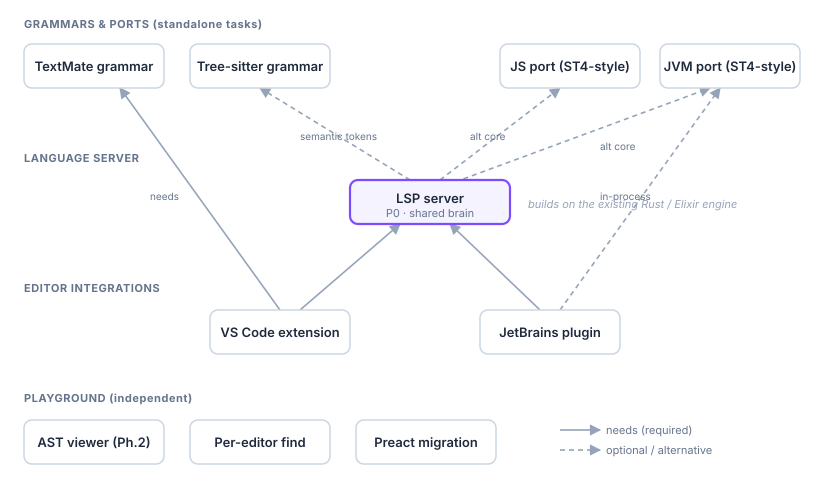

# Stem Backlog

Forward-looking work, captured so it isn't lost. Priorities are proposals
(`P0` = next, `P1` = soon, `P2` = later); adjust freely. "Depends on" drives the
graph at the bottom.

## Playground (open points)

| Pri | Item | Depends on | Notes |
|-----|------|-----------|-------|
| P1 | **File-based AST viewer + scope-boundary nodes** | — | Phase 2 of the inspector plan. Clicking a dependency-graph node opens that file's `parse_ast` tree; render `scope`/`partial_scope` nodes explicitly as scope boundaries showing the rebound hash keys. |
| P2 | **Per-editor in-editor find (⌘F)** | — | Complements the cross-file Search panel: `@codemirror/search` for find/replace scoped to the focused editor. |
| P2 | **Preact + htm migration (playground UI)** | — | Incremental, no build step, ~4 KB. Migrate one panel at a time (Search first), keep CodeMirror imperative behind refs. Payoff is maintainability, not a quick win. |
| P2 | **Backref expansion for per-hit replace** | — | Per-occurrence Replace currently inserts the replacement literally; Replace All already expands `$1` in regex mode. Make them consistent. |

## Grammars (editor syntax)

| Pri | Item | Depends on | Notes |
|-----|------|-----------|-------|
| P1 | **TextMate grammar** | — | `.tmLanguage` for Stem templates. Powers VS Code (and many editors) syntax highlighting; the cheapest path to colour in the VS Code extension. |
| P2 | **Tree-sitter grammar** | — | Incremental parse tree for structural highlighting, folding, and selection; foundation for richer editor features and possibly semantic LSP tokens. |

## Language server & editor integrations

| Pri | Item | Depends on | Notes |
|-----|------|-----------|-------|
| P0 | **LSP (language server)** | a core engine | Diagnostics (the recoverable-error accumulator already exists), hover, go-to-partial, completion, rename. Built on an existing backend (Rust/Elixir) or a port. The shared brain for both editor plugins. |
| P1 | **VS Code extension** | TextMate grammar, LSP | Syntax via TextMate; intelligence via the LSP client. The flagship integration. |
| P2 | **JetBrains plugin** | LSP | Intelligence via LSP4IJ (or native PSI). Could run the server in-process on the JVM port. |

## Engine ports (ST4-style: codegen + core)

| Pri | Item | Depends on | Notes |
|-----|------|-----------|-------|
| P2 | **JS port** | — | Pure-JS codegen/core like StringTemplate 4. Could power the playground and a TS-based VS Code extension without WASM. |
| P2 | **JVM port** | — | JVM-native codegen/core like ST4. Enables an in-process JetBrains plugin and JVM-host adoption. Largest effort. |

---

## Dependency graph

Solid arrows = required dependency; dashed = optional / alternative path. The
LSP is the pivot: it builds on a core (Rust today; Elixir/JS as alternatives)
and feeds both editor integrations. The playground items run on the Rust/WASM
core and are otherwise independent.
